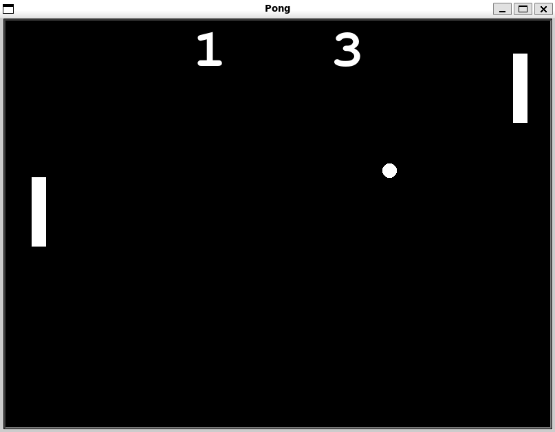

# PyArcade

PyArcade is a collection of classic arcade games implemented using Python's Turtle graphics module. The games include Snake, Pong, Turtle Crossing, and Turtle Race. The application provides an interface to select and play these games.

## Table of Contents

- [Project Structure](#project-structure)
- [Usage](#usage)
- [Games](#games)
  - [Snake](#snake)
  - [Pong](#pong)
  - [Turtle Crossing](#turtle-crossing)
  - [Turtle Race](#turtle-race)


## Project Structure

```
PyArcade/
├── assets/
│   └── arcade-game.gif
├── pong_game/
│   ├── ball.py
│   ├── border.py
│   ├── paddle.py
│   ├── pong.py         *this file contains the main function of the game
│   └── scoreboard.py
├── snake_game/
│   ├── border.py
│   ├── data.txt
│   ├── food.py
│   ├── scoreboard.py
│   ├── snake_game.py   *this file contains the main function of the game
│   └── snake.py
├── turtle_crossing_game/
│   ├── car_manager.py
│   ├── player.py
│   ├── scoreboard.py
│   └── turtle_crossing.py  *this file contains the main function of the game
├── turtle_race_game/
│   └── turtle_race.py   *this file contains the main function of the game
├── button.py
├── main.py
└── README.md
```

## Usage

Ensure you have Python installed (preferably version 3.6 or later).

1. Run the main application:
    ```bash
    python main.py
    ```

2. The main screen will display four buttons for each game:
   - Snake
   - Pong
   - Turtle Crossing
   - Turtle Race

<p style="text-align: center;">
    
</p>

3. Select a game by clicking the corresponding button on the screen.

To close the application, click on the screen in the main page or click the `X` button located in the top right corner of the window during the games. This will exit the application and close the window.

## Games

### Snake

Control the snake using the arrow keys to eat food, grow longer, and avoid colliding with the walls or yourself.

<p style="text-align: center;">
    
</p>

**Controls:**
- Arrow keys to move the snake.

**Game Features:**
- Randomly placed food.
- Snake grows longer with each food eaten.
- Game ends if the snake collides with the walls or itself.
- Score tracking with high score saved to a file.

**Files:**
- `snake_game/snake_game.py`
- `snake_game/snake.py`
- `snake_game/food.py`
- `snake_game/border.py`
- `snake_game/scoreboard.py`
- `snake_game/data.txt` to store the high score of the player

### Pong

A two-player game where players use the `Up` and `Down` keys (right paddle) and `W` and `S` keys (left paddle) to move the paddles and bounce the ball. The goal is to score points by getting the ball past the opponent's paddle.

<p style="text-align: center;">
    
</p>

**Controls:**
- Right paddle: Up and Down arrow keys.
- Left paddle: W and S keys.

**Game Features:**
- Ball bounces off paddles and walls.
- Score tracking for both players.
- Speed of the ball increases after hitting the paddles.

**Files:**
- `pong_game/pong.py`
- `pong_game/paddle.py`
- `pong_game/ball.py`
- `pong_game/border.py`
- `pong_game/scoreboard.py`

### Turtle Crossing

Help the turtle cross the road by moving it upward using the `Up` key. Avoid the moving cars and reach the top of the screen to progress to the next level.

<p style="text-align: center;">
    
</p>

**Controls:**
- Up arrow key to move the turtle.

**Game Features:**
- Moving cars of different colors and speeds.
- Levels increase as the turtle successfully crosses the road.
- The speed of the cars increases as the player reaches a higher level.
- Game ends if the turtle collides with a car.

**Files:**
- `turtle_crossing_game/turtle_crossing.py`
- `turtle_crossing_game/player.py`
- `turtle_crossing_game/car_manager.py`
- `turtle_crossing_game/scoreboard.py`

### Turtle Race

Place a bet on a turtle's color and watch the turtles race to the finish line. The game prompts the user to enter a bet and announces the winner once a turtle crosses the finish line.

<p style="text-align: center;">
    
    
    
</p>

**Controls:**
- Input to place a bet.

**Game Features:**
- Six turtles of different colors race to the finish line.
- Random speed for each turtle.
- Betting system to guess the winning turtle.

**Files:**
- `turtle_race_game/turtle_race.py`
